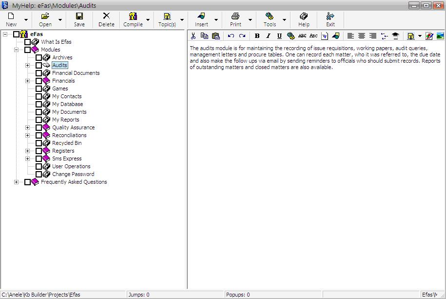



## MyHelp

### Description

Compile help files from scratch using a tree structure and side rich text box for the topic contents. Please vote of you like.
 
### More Info
 
Download windows help compiler and install in in the Help folder where you will be running this program. app.path &amp; "\Help\hcw.exe" should exist for the help file compilation.

Help contents and help file in .hlp and .cnt format. Compile all your topics to a single rtf file with the necessary hyperlinks etc.

             |
---                |---
**Submitted On**   |2008-08-26 09:49:00
**By**             |[Anele Mbanga](https://github.com/Planet-Source-Code/PSCIndex/blob/master/ByAuthor/anele-mbanga.md)
**Level**          |Advanced
**User Rating**    |4.7 (14 globes from 3 users)
**Compatibility**  |VB 6\.0
**Category**       |[Complete Applications](https://github.com/Planet-Source-Code/PSCIndex/blob/master/ByCategory/complete-applications__1-27.md)
**World**          |[Visual Basic](https://github.com/Planet-Source-Code/PSCIndex/blob/master/ByWorld/visual-basic.md)
**Archive File**   |[MyHelp2124908272008\.zip](https://github.com/Planet-Source-Code/anele-mbanga-myhelp__1-71013/archive/master.zip)

